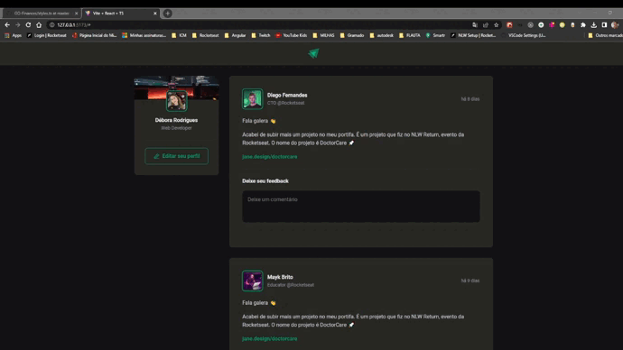

# Ignite News
Projeto desenvolvido durante aula do curso, para aprender conceitos do react. Por se tratar de um projeto para passar conceitos, todo projeto está estático
e apenas algumas funcionalidades pontuais estão funcionando.



## Funcionalidades:
  * Listar Posts
  * Adicionar Comentário
  * Excluir Comentário

  ## Iniciar Projeto
  ```
  npm i
  ```
   ```
  npm run dev
  ```
  

